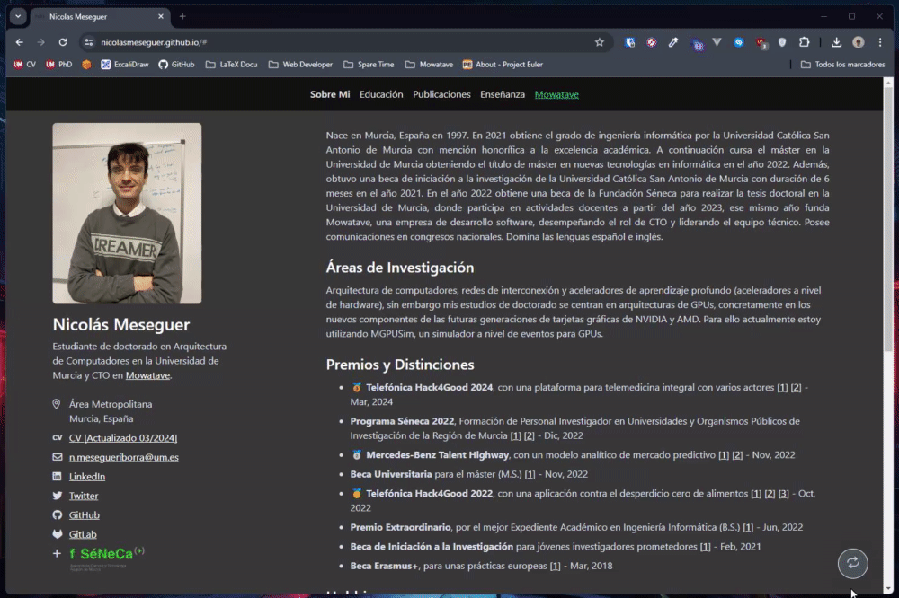

<h1 align="center">
  <br>
  <a href="https://github.com/NicolasMeseguer/nicolasmeseguer.github.io"></a>
  <br>
  Academic Portfolio
  <br>
</h1>

<h4 align="center">An awesome academic portfolio template for GitHub Pages!</h4>

<p align="center">
  <a href="https://github.com/NicolasMeseguer/nicolasmeseguer.github.io/graphs/contributors">
    
  </a>
  <a href="https://github.com/NicolasMeseguer/nicolasmeseguer.github.io/network/members">
    
  </a>
  <a href="https://github.com/NicolasMeseguer/nicolasmeseguer.github.io/stargazers">
    
  </a>
  <a href="https://github.com/NicolasMeseguer/nicolasmeseguer.github.io/issues">
    
  </a>
  <a href="http://creativecommons.org/licenses/by-sa/4.0/">
    
  </a>
  <a href="https://github.com/NicolasMeseguer/nicolasmeseguer.github.io/releases">
    
  </a>
</p>

<p align="center">
  
  
  
</p>

<p align="center">
  <a href="https://nicolasmeseguer.github.io/">View Demo</a> •
  <a href="https://github.com/NicolasMeseguer/nicolasmeseguer.github.io/issues/new?labels=bug&template=_bug-report.md">Report Bug</a> •
  <a href="https://github.com/NicolasMeseguer/nicolasmeseguer.github.io/issues/new?labels=enhancement&template=_feature-request.md">Request Feature</a>
</p>

<p align="center">
  
</p>

## Key Features

- 🎓 **Academic**: Perfect for students and academics.
- 📦 **Easy to Use**: Just fork, edit and deploy!
- 🚀 **Blazingly Fast**: Built with performance in mind.
- 🌍 **Multi-Language**: Add multi-language support with ease.
- 📱 **Responsive**: Works on all devices.
- 🌙 **Dark Mode**: Toggle between light and dark mode.
- 📰 **BibTeX**: Add citations effortlessly and provide an easy way to copy it.
- 🎨 **Customizable**: Easily change the theme colors and add your own touch.
- 📊 **Insights**: Connect your portfolio to Google Analytics to get insights.
- 🌐 **SPA**: Single Page Application for a seamless experience.
- 🛠️ **Maintenance**: Regular updates and improvements.
- 📚 **Documentation**: Detailed documentation to help you get started.

## How To Use

1. Fork this repository [here](https://github.com/NicolasMeseguer/nicolasmeseguer.github.io/fork).
2. Go to the settings of your forked repository and rename it to `yourusername.github.io`.
3. Create a new branch called `gh-pages`.
4. Go to the settings of your repository and enable GitHub Pages.
5. Select the `gh-pages` branch as the source.
6. Consider giving this repository a star if you found it useful 🤍.

Now you can access your very own portfolio at `https://yourusername.github.io` 🚀.

## Multi-Language

¿Want to add multi-language support? It's easy! Just follow these steps:

1. Add your language to the `assets/js/languages.json` file, according to ISO 3166 alpha-2 standard. For example, for english and spanish:

```json
"en": {
  "flag": "https://flagcdn.com/w20/us.png"
},
"es": {
  "flag": "https://flagcdn.com/w20/es.png"
}
```

2. Add the class `language` to each `<tag>` you would like to translate, and include the `data-` attribute with the translation. For example, for a greeting in english and spanish:

```html
<tag class="language" data-en="Hello" data-es="Hola">
  <!-- You can leave this empty -->
</tag>
```

3. Enjoy your blazingly fast multi-language portfolio! 🌍

## Add a New Section

Let's say you want to add a new section to your portfolio, called `Photos`. Here's how you can do it:

1. **Update the Navigation Bar**: Add a new list item `li` to the navigation bar in your `index.html`. This will serve as the link to your new section:

```html
<ul class="navbar-nav mx-auto language" id="navbarList">
  ...
  <li class="nav-item">
    <a
      class="nav-link"
      id="photos"
      href="#"
      data-en="Photos"
      data-es="Fotos"
    ></a>
  </li>
</ul>
```

2. **Create the Section Content**: Insert a new `div` within the section container `id="section-content"` in `index.html`, using the `id` as the name followed by `Content`:

```html
<div class="row content" id="section-content">
  ...

  <!-- Photos -->
  <div class="col-md-8 offset-md-1 mb-5" id="photosContent">
    ...
  </div>
</div>
```

3. **Implement Navigation Interaction**: Ensure that when the "Photos" navigation item is clicked, the corresponding content is displayed correctly, while other sections are hidden:

```javascript
$(document).ready(function(){
  $('#photosContent').hide(); // Initially hide the Photos section

  $('#photos').click(function(e) {
    if(!$(e.target).hasClass('active')) {
      clearActiveLinks(); // Clear all active states from other nav-links
      activateLink(e);    // Set this link as active

      clearActiveDivs();  // Hide all other content divs
      activateDiv('#photosContent'); // Display the Photos section
    }
  });
});
```

Additionally, if you would like to hide a section, you can do so by adding the `d-none` class to the `nav-link` (or, following the example above in reverse order, removing everything related to `Photos`):

```html
<li class="nav-item">
  <a class="nav-link d-none" id="photos" href="#" 
    data-es="Fotos" 
    data-en="Photos">
  </a>
</li>
```


## Insights

1. Go to [Google Analytics](https://analytics.google.com/) and create a new account.
2. Once looged in, on the left sidebar, look for the `Manage` button.
3. Under `Property Settings`, look for `Data collection and modification` > `Data flows` > `Add flow`, and select `Web`.
4. Fill in the required fields (Website URL and Name) and click on `Create flow`.
5. Copy the `Measurement ID` (should look like `G-XXXXXXXXXX`) to `assets/js/config.json`.
6. Eventually, you will be able to see your portfolio's insights on Google Analytics.

## Contributing

Feel free to contribute to this project. You can do so by forking the project and submitting a pull request. Find a list of issues/TODOs in the [issues tab](https://github.com/NicolasMeseguer/nicolasmeseguer.github.io/issues). Suggestions or feedback are well received.

## License

[](http://creativecommons.org/licenses/by-sa/4.0/)

[nicolasmeseguer.github.io](https://github.com/NicolasMeseguer/nicolasmeseguer.github.io) © 2023 by [Nicolas Meseguer](https://github.com/NicolasMeseguer) is licensed under [Creative Commons Attribution-ShareAlike 4.0 International License](http://creativecommons.org/licenses/by-sa/4.0/).
